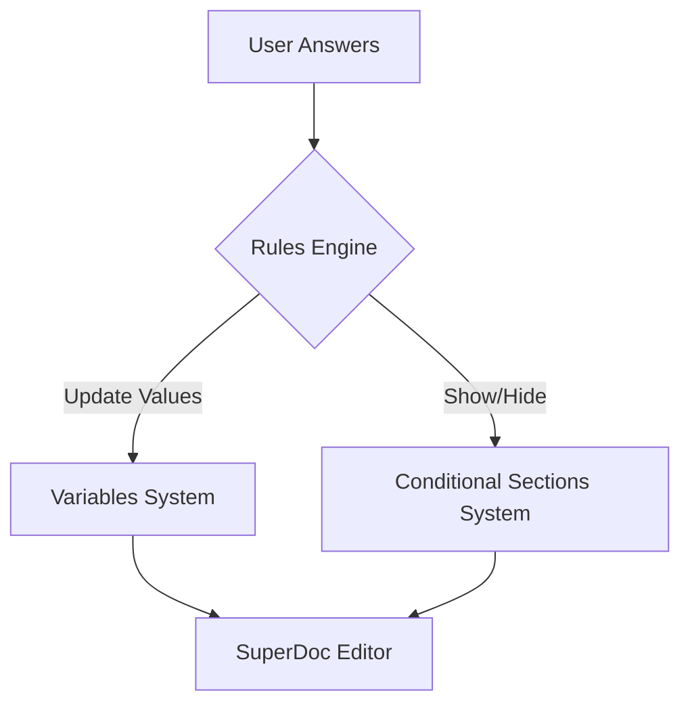

# Document Templates & Automation

**Status:** 📋 Planned
**Related Specs:**
- `features/conditional-sections.md` (The mechanism for show/hide logic)
- `features/variables.md` (The mechanism for inline data)
- `architecture/USER-WORKFLOWS.md`

---

## Overview

**Templates** turn static documents into dynamic, reusable automation workflows.
Instead of manually editing a copy of a document ("Save As..."), users create a **Master Template** defined by:
1.  **Static Content**: The boilerplate text.
2.  **Variables**: Inline placeholders (e.g., `[Company Name]`).
3.  **Conditional Sections**: Blocks of content that appear/disappear based on rules.
4.  **Automation Rules**: The logic connecting User Answers -> Document Structure.

The **Template System** provides the "Wizard" experience: a user selects a Template, answers a series of questions (the "Interview"), and the system generates a perfect custom document instance.

---

## Core Concepts

### 1. The "Template"
A Template is simply a standard SuperDoc document with additional metadata:
- **Marked as Template**: Flagged in the system as a source for new documents.
- **Embedded Rules**: Contains the logic for Variables and Sections.
- **Question Set**: The ordered list of questions to ask the user.

### 2. The "Wizard" (Document Generation)
The end-user interface for creating a document from a template.
- **Input**: User answers questions (Radio, Text, Date).
- **Process**: Real-time evaluation of rules.
- **Output**: A new document instance with:
    - Variables filled.
    - Irrelevant sections removed.
    - Relevant sections inserted.

### 3. The "Builder" (Template Editing)
The admin/editor interface for creating the automation.
- **Action**: User opens a document.
- **Tools**:
    - **Variable Manager**: Define placeholders.
    - **Section Manager**: Define conditional blocks.
    - **Rule Builder**: Link Questions to Sections.

---

## User Experience

### Scenario 1: Creating a Template (The "Builder")
*Persona: Legal Ops / Admin*

1.  **Import/Open**: Admin opens an existing Contract (e.g., "MSA Master").
2.  **Define Variables**:
    - Highlights "OpenGov, Inc." -> Replaces with Variable `[Vendor Name]`.
    - Highlights "2024-01-01" -> Replaces with Variable `[Effective Date]`.
3.  **Define Sections**:
    - Selects the "Federal Compliance" paragraph.
    - Clicks "Make Conditional Section".
    - Assigns ID: `sec-federal-compliance`.
4.  **Define Logic (The Automation)**:
    - Opens "Automation" tab.
    - Creates Question: "Is this a Federal Contract?" (Yes/No).
    - Creates Rule: `IF "Federal Contract?" == "Yes" THEN SHOW section "Federal Compliance"`.
5.  **Save**: Saves document as "MSA Template".

### Scenario 2: Generating a Document (The "Wizard")
*Persona: Sales Rep / End User*

1.  **New Document**: Click "New from Template" -> Selects "MSA Template".
2.  **Wizard Mode**:
    - Split screen: Document Preview (Read-only) | Wizard Panel (Right side).
    - **Question 1**: "Vendor Name?" -> User types "Acme Corp".
        - *Effect*: Document preview updates all `[Vendor Name]` instances in real-time.
    - **Question 2**: "Is this a Federal Contract?" -> User selects "Yes".
        - *Effect*: "Federal Compliance" section magically appears in the preview.
    - **Question 3**: "Effective Date?" -> User picks date.
3.  **Finalize**: Click "Create Document".
4.  **Result**: A standard, editable document is created. The "Template" connection is severed (or maintained for re-running the wizard).

---

## Technical Implementation

### Architecture Overview

The Template system sits on top of the **Variables** and **Conditional Sections** foundations. It orchestrates them via a central **Rules Engine**.



### 1. Cross-Platform Parity (Web & Add-in)
As per the *Document Section Extension* research, we utilize **SuperDoc Native Features** to ensure identical behavior on both platforms.

- **Web**: React Sidepane renders the Wizard. SuperDoc Editor renders the preview.
- **Word Add-in**: React Sidepane (Taskpane) renders the Wizard. The invisible SuperDoc instance (or direct Word API) manipulates the Word document surface in real-time.

### 2. Data Structure

**Template Metadata (`data/templates/{id}.json`)**:
```json
{
  "templateId": "tpl-msa-v1",
  "baseDocumentId": "doc-123-xyz",
  "questions": [
    {
      "id": "q_federal",
      "type": "radio",
      "label": "Is this a Federal Contract?",
      "options": ["Yes", "No"]
    },
    {
      "id": "q_vendor",
      "type": "text",
      "label": "Vendor Name"
    }
  ],
  "mappings": {
    "variables": {
      "q_vendor": "var-vendor-name"
    },
    "sections": {
      "q_federal": {
        "value": "Yes",
        "action": "show",
        "targetSectionId": "sec-federal-compliance"
      }
    }
  }
}
```

### 3. The Rules Engine
A shared JavaScript library (used by both Web and Add-in) that evaluates the state.

```javascript
// pseudo-code
function evaluateWizardState(answers, templateConfig) {
    const operations = [];

    // 1. Handle Variables
    for (const [questionId, varId] of Object.entries(templateConfig.mappings.variables)) {
        if (answers[questionId]) {
            operations.push({ type: 'UPDATE_VARIABLE', varId, value: answers[questionId] });
        }
    }

    // 2. Handle Sections
    // See features/conditional-sections.md for deep dive on logic
    for (const [questionId, rule] of Object.entries(templateConfig.mappings.sections)) {
         if (answers[questionId] === rule.value) {
             operations.push({ type: 'SHOW_SECTION', sectionId: rule.targetSectionId });
         } else {
             operations.push({ type: 'HIDE_SECTION', sectionId: rule.targetSectionId });
         }
    }

    return operations;
}
```

---

## Integration with SuperDoc Extensions

### Document Section Extension
We leverage the native extension for managing the structural blocks.

```javascript
// From user provided docs
import { DocumentSection } from '@harbour-enterprises/superdoc/extensions';

// In the Wizard, when a rule triggers 'SHOW_SECTION':
editor.commands.createDocumentSection({
  id: 'sec-federal-compliance',
  title: 'Federal Compliance',
  isLocked: true, // Templates sections are often locked
  html: loadSectionContentFromTemplate('sec-federal-compliance') 
});
```

### Field Annotations / Variables
We leverage the existing Variable system for inline text.

```javascript
// In the Wizard, when a user types in a text field:
editor.commands.updateVariableInDocument({
    varId: 'var-vendor-name',
    value: 'Acme Corp'
});
```

---

## Implementation Phases

### Phase 1: The Wizard UI
*Goal: Build the questionnaire interface.*
- [ ] Create `TemplateWizard` React component.
- [ ] Support Question Types: Text, Radio, Checkbox, Date.
- [ ] State management for `answers`.

### Phase 2: Template Data Model
*Goal: Define how we store the "Template".*
- [ ] Define JSON schema for Templates.
- [ ] Create API endpoints to save/load Template configurations.

### Phase 3: Wiring It Up
*Goal: Connect Wizard to Document.*
- [ ] Implement `evaluateWizardState` logic.
- [ ] Connect to `Conditional Sections` API (show/hide).
- [ ] Connect to `Variables` API (update values).

### Phase 4: The Builder UI
*Goal: Allow admins to create templates without coding.*
- [ ] "Make Template" mode in the Editor.
- [ ] UI to add/edit Questions.
- [ ] UI to map Questions to Sections/Variables.

---

## Success Metrics
1.  **Speed**: Generating a document via Wizard is 5x faster than manual "Save As" + editing.
2.  **Accuracy**: 100% reduction in "forgot to remove the federal section" errors.
3.  **Parity**: Wizard works identically in Word Add-in and Web Browser.


